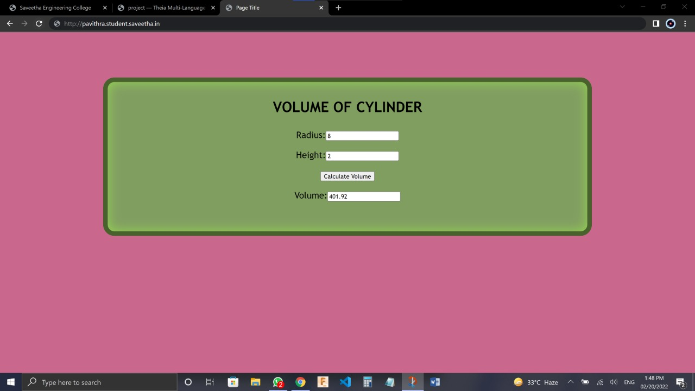

# Design a Website for Server Side Processing

## AIM:
To design a website to perform mathematical calculations in server side.

## DESIGN STEPS:

### Step 1:
Desing your website for calculation using wireframe work.

### Step 2:
Then to execute the wireframe work desing use html,css

### Step 3:
Use views.py to execute the coding in serverside.

### Step 4:
Mention the path of the website in urls.py.

### Step 5:
Publish the website in the given URL.
## PROGRAM :
### Area.html
~~~
<!DOCTYPE html>
<html>
<head>
    <meta charset='utf-8'>
    <meta http-equiv='X-UA-Compatible' content='IE=edge'>
    <title>Page Title</title>
    <meta name='viewport' content='width=device-width, initial-scale=1'>
    
</head>

<body>
    

        <h1>VOLUME OF CYLINDER</h1>
        <form method="POST">
            
            
 
                Radius:<input type="text" name="radius" value={{r}}></input> 
            

            

                Height:<input type="text" name="height" value={{h}}></input> 
            

            

                <input type="submit" value="Calculate Volume"></input> 
            

            

                Volume:<input type="text" name="volume" value={{volume}}></input>
            

        </form>
    

    
</body>
</html>
~~~
### View.py
~~~
from django.shortcuts import render

def volumecalculation(request):
    context ={}
    context["volume"]='0'
    context["r"]='0'
    context["h"]='0'
    if request.method == 'POST':
        
        r=request.POST.get('radius','0')
        h=request.POST.get('height','0')
        volume= 3.14*int(r)*int(r)*int(h)
        context['volume'] = volume
        context['r']=r
        context['h']=h
    return render(request,"mathapp/area.html",context)
~~~
### Url.py
~~~
from django.contrib import admin
from django.urls import path
from mathapp import views

urlpatterns = [
    path('admin/', admin.site.urls),
    path('volumeofcylinder/',views.volumecalculation,name="volumeofcylinder"),
    path('',views.volumecalculation,name="volumeofcylinder")
]
~~~
## OUTPUT:
)
## Result:
A website to perform mathematical calculations in server side is created.
